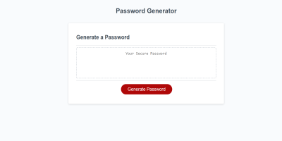

# RandomPasswordGenerator

# App Screenshot

# Description

Tired of getting told your password is weak? There's a solution for that. When you use this password generator, you can create a randomly
generated password of your desired length and choose which types of characters to include. This app uses JavaScript, CSS, and HTML to generate a random password for you.

The URL for this website is: https://sjlevalley.github.io/PasswordGenerator/

## Installation

This website requires no special programs for viewing.

## Usage

This website is interactive and takes user input to function

## Credits

Credit for this website goes to the UCSD-Extention Coding Bootcamp

## License

---

## Badges

None

## Features

There are no special features in this project.

## How to Contribute

N/A

## Tests

N/A
